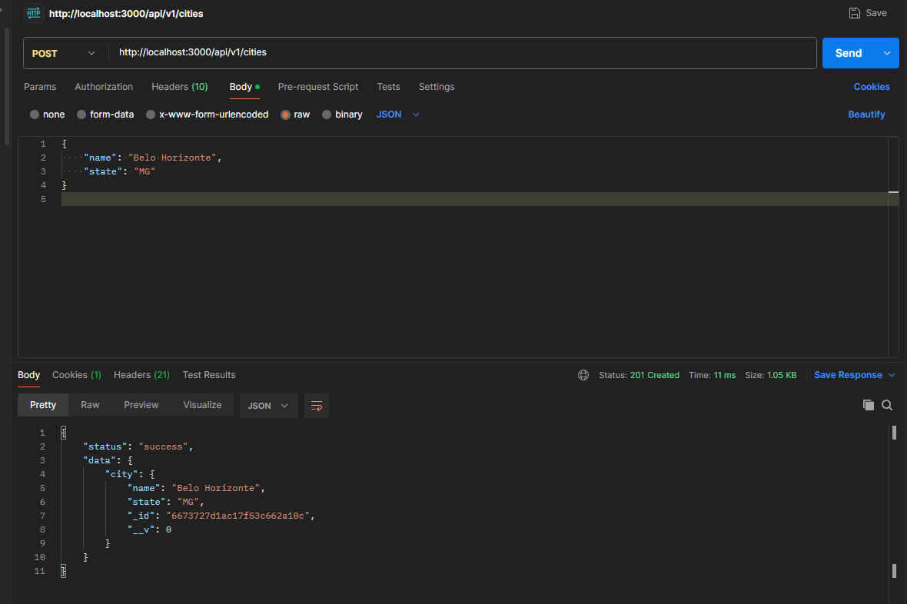
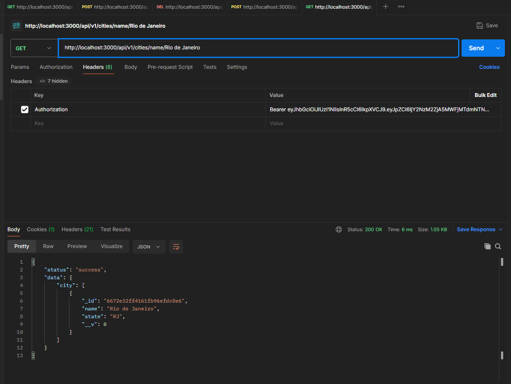

# Projeto de APIs Progress Report

Este projeto consiste em uma API que armazena dados de clientes e de cidades em um banco de dados, permitindo consultas, alteração de nome e remoção de cliente.
Além disso possui uma certa camada de autenticação, necessitando de cadastro e login de usuário para utilizar suas operações. O banco de dados usado é o MongoDB

## Pré-requisitos

- Node.js
- Docker

## Executando 

Primeiramente, instale as dependências:

```bash
npm install
```

Após isso, crie um arquivo `.env` e o preencha de acordo com `.env.example`.<br>
Então use estes comandos no terminal:

```bash
docker compose up -d # para iniciar o docker de MongoDB e o Adminer
npm run # para iniciar a API
```

## Exemplos de uso:

### Cadastro e login de cliente

Primeiramente criando um usuário na rota `/api/v1/users/signup` com o método POST, utilizando um JSON seguindo este exemplo:

```JSON
  {
    "name": "Peter da Silva",
    "gender": "male",
    "birthdate": "2050-09-04",
    "hometown": "Ibirité",
    "password": "pass1234",
    "passwordConfirm": "pass1234"
  }
```


Recebemos um token que já podemos usar de forma de autenticação, porém para logins futuros, vamos para `api/v1/users/login` com o seguinte JSON:

```JSON
{
    "name": "Peter da Silva",
    "password": "pass1234"
}
```


### Consultar cliente

Podemos consultar todos os clientes utilizando o método GET na rota `api/v1/users`.


Porém se não estivermos autenticados teremos este erro:


Também podemos consultar cliente por ID e por nome.


### Alterar nome do cliente

Utilizando método PATCH na rota `api/v1/users/changeName` podemos alterar nosso nome de usuário.


### Remover cliente

Com o método delete em `api/v1/users/id:`, podemos remover o usuário que tem o ID especificado na rota. <br>

Antes:


Depois:


### Cadastro de cidade

Qualquer usuário autenticado pode cadastrar cidades, basta acessar a rota `api/v1/cities` com o método POST e um JSON do seguinte modelo:

```JSON
{
    "name": "Belo Horizonte",
    "state": "MG"
}
```



### Consultar cidade

Podemos consultar todas as cidades com o método Get na rota `api/v1/cities`:


Se quiser filtrar por estado, utilizamos a rota `api/v1/cities/state/state:`


Se quiser filtrar por nome, utilizamos a rota `api/v1/cities/name/name:`



## Códigos de retorno

Além disso, essa API possui os seguintes códigos de retorno

Essa API possui as seguintes operações:

* 200 - Success
* 201 - Created
* 204 - No Content
* 404 - Not found
* 500 - Internal Server Error
